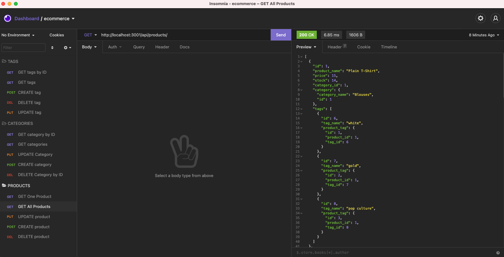

# Company Employee Tracker

## Description

- This application's purpose it so manage an internet retail company's database.

[Walkthrough Video](https://watch.screencastify.com/v/6j5pFogVtJqJKGfhJ9dG)

## Installation

Clone the repository to your local computer and navigate to the repo in your terminal. Run 'cd Develop' to navigate to the develop folder as all of the necessary package.json dependencies are in the Develop folder. Ensure you have MySql installed and to run 'npm install' in your terminal to install all necessary dependencies. Run 'npm run seed' to seed the database. Simply run 'npm start' from the root of the directory to start the server.

## Usage

This application is intended to manage a SQL database holding information for an internet retail company, with product information including price, stock, tags for the product, and categories for the product. Users are able to add, delete, and/or update products, categories, and/or tags to the database,

## Built with:

- SQL
- Sequelize
- Javascript
- Node.js

## This application can be found:

- [Repository](https://github.com/michellewehr/e-commerce-back-end)

## Contribution

Anyone is welcome to contribute to this project. To do so, clone the local repository to your local workspace, create a git feature branch and request a pull request. Upon review, the pull request will then be accepted or denied.

## Sources

- This project was inspired by UCONN's School of Engineering Coding Bootcamp.
- Starter code was provided by The Coding Bootcamp, where the starter code repository found [here](https://github.com/coding-boot-camp/fantastic-umbrella).

## Author

Michelle Wehr
